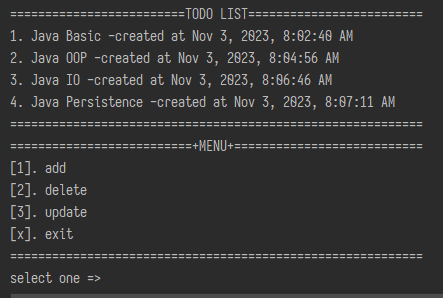
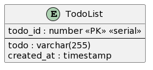

# Todolist Database
This is a terminal-based to-do list application. It allows users to add, delete, and modify tasks. The added tasks are stored in the database.




## how to run app
- download and install [JDK 17](https://www.oracle.com/java/technologies/javase/jdk17-archive-downloads.html)
- setup _environment_ and check java version installation on terminal
    - ```shell
      java --version
- download this _repository_ or download **todolist-database-1.0-SNAPSHOT** in the repository
- open terminal and go to file **todolist-database-1.0-SNAPSHOT** run the program
    - ````shell
      C:\Users\YourComputer\Downloads\todolist> java -jar todolist-database-1.0-SNAPSHOT.jar

## Entity Relationship Diagram


````shell
CREATE TABLE todolist(
      todo_id SERIAL,
      todo VARCHAR(255) NOT NULL,
      created_at TIMESTAMP WITH TIME ZONE DEFAULT (CURRENT_TIMESTAMP AT TIME ZONE 'Asia/Jakarta'),
      PRIMARY KEY (todo_id)
);
````

## Using Technology
- Java
- PostgreSQL
